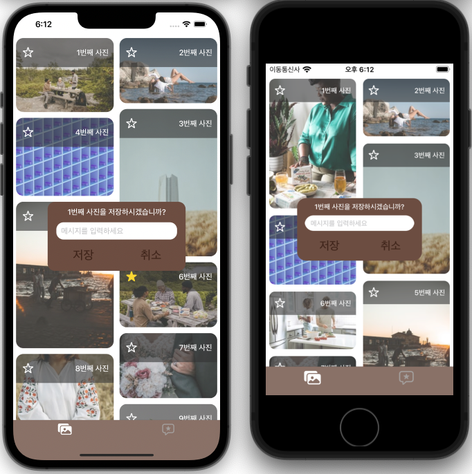
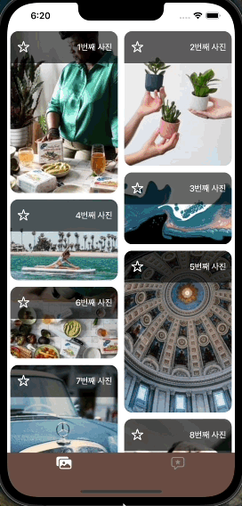
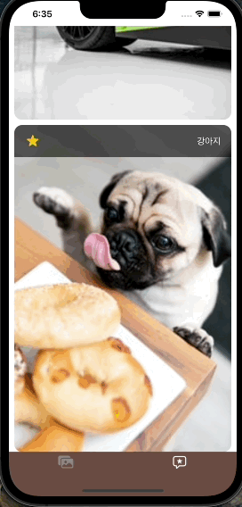
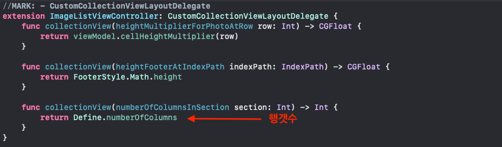
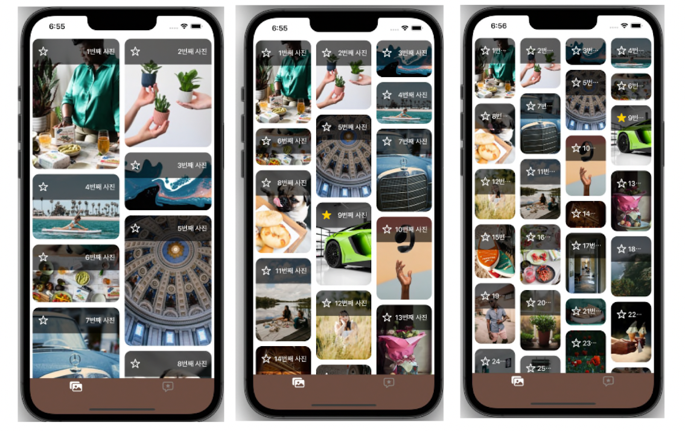
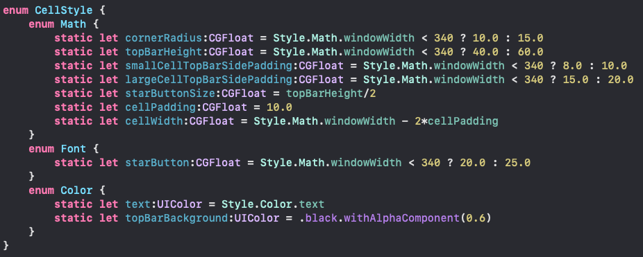
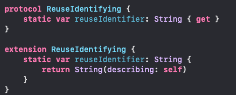
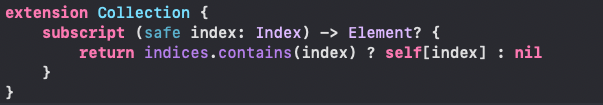
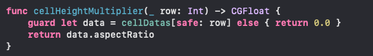

# 원티드 iOS 프리온보딩(with 야곰아카데미) - Picterest App  [2022.07.25 &#126; 2022.07.30] 
개발과정이담긴 👉🏻 <a href="https://github.com/kirkim/ios-wanted-Picterest/issues?q=is%3Aissue+is%3Aclosed">깃허브이슈 페이지</a>

# 🧑‍🍳 Maker

|                                        커킴                                        |
| :--------------------------------------------------------------------------------: |
|  |
|                                        개발                                        |

# 프로젝트 목표

> 서버 API를 이용하여 이미지를 받아와, 가변 세로 길이의 레이아웃으로 나타냅니다. 
> 원하는 사진을 선택해 저장하는 기능을 갖습니다. 
> 아이폰, 세로 모드만 지원하는 앱입니다. 

 

# 🏗 앱동작 설명

## 오토레이아웃 (ipodtouch7 ~ iphoneProMax13)

- 최대한 모든 기종에서 자연스럽게 보일 수 있도록 UI를 구현하였습니다.

 

## 더보기 버튼과 끌어당겨 새로고침하는 기능

- 더보기 버튼을 이용하여 새로운 이미지를 15개씩 무한히 가져올 수 있습니다.
- 모든이미지들은 해당이미지의 비율에 맞게 셀높이가 조정되어 나타나게 됩니다.
- 콜렉션뷰를 끌어당겨서 새로고침을 하면 모든셀데이터를 리셋한 뒤 최초의 15개 이미지를 다시 받아옵니다.

|                            더보기버튼 기능                             |                       끌어당겨 새로고침하는 기능                       |
| :--------------------------------------------------------------------: | :--------------------------------------------------------------------: |
|  |  |

 

## 메모와 함께 사진이 저장되는 기능

- 별버튼을 클릭하여 이미지를 저장할 수 있고 저장완료시 별버튼이 실시간으로 변합니다.
- 이미지의 정보를 CoreData에 저장, 이미지파일을 FileManager를 통해 별도의 앱폴더에 저장합니다.
- 두번째탭의 화면에서 실시간으로 저장된 이미지를 확인할 수 있습니다.

 

## 저장된사진을 길게 클릭하면 삭제되는 기능

- 두번째화면에서 저장된사진을 길게 클릭하면 알림창을 통해 이미지를 삭제할 수 있습니다.
- 이미지를 삭제하게 되면 CoreData에 있는 이미지정보가 삭제되며, FileManager를 통해 앱폴더에 저장된 이미지를 삭제하게 됩니다.
- 삭제한 뒤에 첫번째화면에 돌아와보면, 해당이미지의 별모양의 상태가 다시 바뀌었음을 확인할 수 있습니다.

  
___

# 🚀 사용한 기술

`MVVM Pattern` `Delegate Pattern` `Code-based UI` `NSCache` `CoreData` `FileManager` `UICollectionViewLayout`

    
 <h2>MVVM Pattern</h2>

    <h3> 1. MVVM 패턴을 사용한 이유</h3>
    <ul>
	    <li> 이번 프로젝트는 이미지의 데이터를 최초로 네트워크통신을 이용해 가져옵니다. 그 후 추가 동작에 따라 <code>CoreData</code>를 이용하여 저장하고, 이미지파일을 <code>FileManager</code>를 이용하여 저장합니다.
이 모든 작업을 <code>View</code>에서 하기에는 무리가 있습니다. 그렇기 때문에 <code>ViewModel</code>을 만들어 데이터를 주고받는 역할을 하도록하고 추가로 이벤트를 처리하는 작업도 하도록 만들었습니다.</li>
    </ul>
    <h3> 2. 이번 프로젝트에서 사용한 곳</h3>
    <ul>
      <li>이번 프로젝트는 크게 화면이 <code>2개</code>입니다. 이 2개의 화면에만 ViewModel을 만들어주었습니다.</li>
      <ol>
        <li>ImageListViewController (첫번째 화면)</li>
        <li>SavedImageListViewController (두번째 화면)</li>
      </ol>
      <li>Alert와 같은 다소 작은 뷰들은 <code>delegate</code>를 이용하여 이벤트를 처리하도록 하였습니다.</li>

		
 <h2>Delegate Pattern</h2>

    <h3> 1.딜리게이트 패턴을 사용한 이유</h3>
    <ul>
      <li>이번 프로젝트에서는 <code>RxSwift</code>를 사용하지 않고 만든 프로젝트입니다. 그래서 이벤트전달을 하기위해 떠오른 방법이 <code>노티피케이션</code>과 <code>델리게이트패턴</code>입니다. 노티피케이션은 이벤트의 전달과정을 파악하기가 쉽지않고 실수를 할 가능성이 큽니다. 반면에 델리게이트패턴을 뷰와 1대1 대응이 되도록 구현한다면 가독성과 유지보수가 좋아지게 됩니다.</li>
  </ul>
    <h3>2. 이번 프로젝트에서 사용한 곳</h3>
    <ol>
      <li>이미지저장버튼클릭이벤트</li>
  		<li>셀추가버튼클릭이벤트</li>
  		<li>커스텀레이아웃의 데이터소스(이미지 aspactRatiom, footer높이, 행갯수)</li>
  		<li>콜렉션뷰의 데이터소스(셀, 셀갯수, 섹션갯수, footer)</li>
  		<li>CollectionDelegateFlowLayout(셀사이즈)</li>
  		<li>셀삭제이벤트(UILongPressGestureRecognizer전달)</li>
  </ol>

		
 <h2>NSCache</h2>

    <h3> NSCache를 사용한 이유</h3>
    <ul>
      <li>앱의 동작중 가장 비용이 드는 동작은 아마도 네트워크통신일 것입니다. 그중에서도 이미지파일의 경우 JSON데이터에 비해 용량이 매우 큰편입니다. 그렇기 때문에 이미 한번 네트워크요청을 해서 받아온 이미지파일이라면 <code>NSCache</code>를 이용하여 임시로 저장하는 것이 효율적일 것 입니다.</li>
  </ul>

		
 <h2>CoreData</h2>

    <h3> CoreData을 사용한 이유</h3>
    <ul>
      <li>이번에 다음과 같은 데이터를 사용하기 위해 사용했습니다.
				<ul>
					<li>ID</li>
					<li>메모</li>
					<li>사진의 원본 url</li>
					<li>사진저장위치(파일명)</li>
					<li>사진의 가로/세로 비율</li>
				</ul>
			</li>
			<li>UserDefault를 이용하여 저장할 수 도있지만 키충돌, 데이터량(약 4096개), 복잡한데이터타입을 저장하기에는 불편(단일데이터 저장적합)의 이유로 위의 데이터를 저장하기에는 적합하지가 않았습니다. 비교적 성능이빠르고 복잡한구조의 데이터를 저장할 수 있는 CoreData를 이용했습니다.</li>
  	</ul>

		
 <h2>FileManager</h2>

    <h3> FileManager을 사용한 이유</h3>
    <ul>
      <li>이번 프로젝트는 이미지파일도 따로 저장합니다. 이미지파일은 용량이 크기 때문에 coreData에 같이 보관하기에는 무리가 있습니다. 그렇기 때문에 FileManager를 이용하여 앱에서 제공해주는 저장공간에 따로 저장하도록 구현했습니다.</li>
  	</ul>

		
 <h2>UICollectionViewLayout</h2>

    <h3> UICollectionViewLayout을 사용한 이유</h3>
    <ul>
      <li>단순하게 콜렉션뷰라면 UICollectionViewFlowLayout을 이용하여 간단하게 구현할 수 있습니다.</li>
			<li>하지만 이번에 첫번째화면의 콜렉션뷰 같은 경우 사진의 비율에 따라 셀높이가 달라지게 됩니다.</li>
			<li>또한 각각의 행의 누적높이가 짧은쪽을 우선순위로 셀이 순차적으로 쌓이도록 구현해야 합니다. 이런식의 구현은 UICollectionViewFlowLayout만으로는 무리가 있습니다. 그렇기 때문에 커스텀레이아웃을 구현하게 되었습니다.</li>
  	</ul>

  
___

# 🌈 기타 프로젝트 특징
	

		
 <h2>다양한 행의갯수로 유연하게 출력가능</h2>

    <ul>
      <li>커스텀레이아웃의 delegate를 이용하여 행의 갯수를 조정해줄 수 있습니다.</li>
				
			<li>행의 갯수가 변하더라도 행이짧은쪽을 우선순위로 셀이 쌓이는 방식은 유지됩니다.</li>
				
  	</ul>

		
 <h2>코드의 Style수치값들을 하드코딩하지않고 Style파일에서 관리</h2>

    <ul>
      <li>뷰의 frame, font, 각종사이즈, UIColor등등을 하드코딩하여 관리하게 되면 가독성이 떨어질 뿐만 아니라 코드수정이 힘들어 집니다.</li>
			<li>그래서 다음과 같이 enum타입의 네임스페이스를 만들어서 Style에 필요한 값들을 관리해주도록 했습니다. 
				
    	</li>
  	</ul>

		
 <h2>ReuseIdentifying프로토콜로 Cell 고유키값을 관리</h2>

    <ul>
      <li>콜렉션뷰에서 셀을 재사용하거나 생성할 때 Cell의 고유키값이 필요합니다. 이 키값을 하드코딩하여 관리하는 것은 실수할 가능성이 크고, 매번 작성하는 것도 번거롭습니다.</li>
			<li>다음과 같이 extension기능을 활용하여 ReuseIdentifying프로토콜을 만들어 사용하면 위의 단점을 보완할 수 있습니다. 
				
    	</li>
  	</ul>

		
 <h2>배열의 index를 안전하게 관리</h2>

    <ul>
      <li>index값을 이용하여 배열의 요소에 접근할때 배열의 범위밖의 index에 접근한다면 앱이 크러쉬날 것입니다.</li>
			<li>다음과 같이 Collection의 extension을 이용하여 subscript를 오버로드 하는 방식을 통해 좀 더 안전하게 배열의 요소에 접근할 수 있도록 만들었습니다.</li>
				
			<li>다음과 같이 guard문을 활용하여 안전하게 배열의 요소에 접근이 가능해 집니다.</li>
				
  	</ul>

